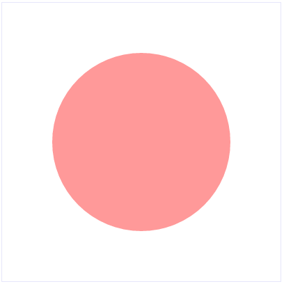
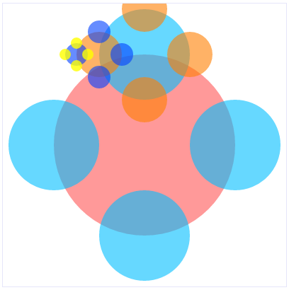

# Enspiraled

For this challenge, you'll be making a basic fractal generator that starts with a single large circle. Click on the circle and four new circles of half the original circle's radius will appear at the cardinal compass points: north, south, east and west. Click on any of those circles and the process is repeated.

## Setup

After cloning this repo

```sh
npm install
npm start
```

and then go to [`http://localhost:3000`](http://localhost:3000).

This is what your starting place looks like:



And after you've completed this project, this is what it can look like after a few clicks:




## Your starting place

As we start our jouney, most of the interesting stuff can be found in `client/components/App.jsx`. Here are its contents:

```jsx
import React from 'react'

class App extends React.Component {
  render () {
    return (
      <svg width='800' height='800'>
        <circle cx={400} cy={400} r={256} />
      </svg>
    )
  }
}

export default App
```

Here we extend `React.Component` to create our own stateful `App` component. React will call its `render` method whenever it needs to render this component. 

Here we're rendering some SVG (Scalable Vector Graphics). In this case, a circle with the center 400px from the top (`cy`) and 400px from the left (`cx`) of the parent `<svg>` element. It has a radius of 256px (`r`) and is filled with a transparent red established in `public/css/app.css`. It's important to note that this JSX will render The SVG elements, _not React controls_. We know this because `<svg>` and `<circle>` are lower case.


## The requirements

Your job is to create a new Circle component in `client/components/Circle.jsx` that wraps this SVG element and adds some new features. The most important of these is an `onClick` property. You'll want to pass a click handling method into your Circles and then pass the center and radius back to the `App`, which will use that information to add the four new circles *if they don't already exist*.


### One way of approaching this

Right now our circle isn't a component, but if we want to create a bunch of identical ones, it will be easier if it is. What would a `<Circle>` component look like? Since it would be responsible for rendering itself, it would need to know the `x` and `y` values of its center and it would need to know its `radius`. It would also need to know if it had been clicked or not (`hasBeenClicked = false`?). With that it can calculate the values of its child Circles.


## Unit tests

Your task: make these tests pass and create an output that looks something like the ones in the images above.


## Hints

If you don't already have it installed, you might like to add the [React plugin](https://chrome.google.com/webstore/detail/react-developer-tools/fmkadmapgofadopljbjfkapdkoienihi?hl=en) to Chrome. This will add a tab in Developer Tools that will allow you to explore the [virtual DOM](http://tonyfreed.com/blog/what_is_virtual_dom) created by React.

These resources might be useful:

- [SVG](https://developer.mozilla.org/en/docs/Web/SVG)
- [`circle`](https://developer.mozilla.org/en-US/docs/Web/SVG/Element/circle)
- [`import`](https://developer.mozilla.org/en-US/docs/Web/JavaScript/Reference/Statements/import)
- [Destructuring assignment](https://developer.mozilla.org/en/docs/Web/JavaScript/Reference/Operators/Destructuring_assignment)
- [`const`](https://developer.mozilla.org/en-US/docs/Web/JavaScript/Reference/Statements/const) variables are mutable!
- [`let`](https://developer.mozilla.org/en/docs/Web/JavaScript/Reference/Statements/let)
- [`export`](https://developer.mozilla.org/en-US/docs/Web/JavaScript/Reference/Statements/export)
- [React Component](https://facebook.github.io/react/docs/reusable-components.html#es6-classes)
- [React Component API](https://facebook.github.io/react/docs/component-api.html)
- [How State Works](https://facebook.github.io/react/docs/interactivity-and-dynamic-uis.html#how-state-works)
- [`setState`](https://facebook.github.io/react/docs/component-api.html#setstate)
- [React Event Handling](https://facebook.github.io/react/docs/interactivity-and-dynamic-uis.html#a-simple-example)
- [`ReactDOM.render`](https://facebook.github.io/react/docs/top-level-api.html#reactdom.render)
- [Color](https://developer.mozilla.org/en/docs/Web/CSS/color_value)
- [React TestUtils](https://facebook.github.io/react/docs/test-utils.html)
- [Mocha](https://mochajs.org/)
- [Chai BDD API](http://chaijs.com/api/bdd/)
- [Ramda](http://ramdajs.com/docs/)
- [browserify](http://browserify.org/)
- [watchify](http://spapas.github.io/2015/05/27/using-browserify-watchify/)

